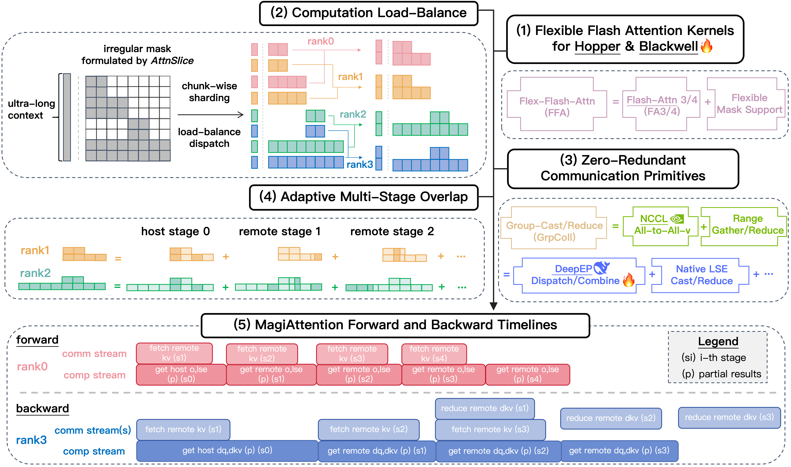

# MagiAttention

<p align="center">
    <a href="https://arxiv.org/pdf/2505.13211"></a>
    <a href="https://SandAI-org.github.io/MagiAttention/docs/"></a>
    <a href="https://SandAI-org.github.io/MagiAttention/docs/main/blog/magi_attn.html"></a>
    <a href="https://github.com/SandAI-org/MagiAttention/releases"></a>
</p>

<p align="center">
    <a href="https://sand.ai"></a>
    <a href="https://magi.sand.ai"></a>
    <a href="https://huggingface.co/sand-ai"></a>
     <a href="https://x.com/SandAI_HQ"></a>
    <a href="https://discord.gg/hgaZ86D7Wv"></a>
    <a href="https://github.com/SandAI-org/Magi/LICENSE"></a>
</p>


<h4 align="center">
A Distributed Attention Towards Linear Scalability for Ultra-Long Context, Heterogeneous Mask Training
</h4>

<div align="center">
  
</div>


## Latest News 🔥

- [2026/02] 🎉 We release [MagiAttention-v1.1.0](https://github.com/SandAI-org/MagiAttention/releases/tag/v1.1.0) to: (1) add early support for **Blackwell** via a new attention kernel backend `FFA_FA4` using forked [Flash-Attention 4](https://github.com/demonatic/flash-attention/tree/magi_attn_blackwell_support); (2) provide full support for **native group collective kernels for both intranode and internode communication** based upon [DeepEP](https://github.com/deepseek-ai/DeepEP); (3) update the [MagiAttention Blog](https://SandAI-org.github.io/MagiAttention/docs/main/blog/magi_attn.html) with comprehensive [Attention Benchmark](https://SandAI-org.github.io/MagiAttention/docs/main/blog/magi_attn.html#attention-benchmark) on H100 and B200, demonstrating SOTA performance and near-linear scalability.

<details>
<summary>2025 News</summary>

- [2025/11] 🚀 We release [MagiAttention-v1.0.5](https://github.com/SandAI-org/MagiAttention/releases/tag/v1.0.5) with native support for **(distributed) learnable attention sink** mechanism in both Flex-Flash-Attention and MagiAttention, plus a drop-in integration for Flash-Attention via our [Extensions](https://github.com/SandAI-org/MagiAttention/tree/v1.0.5/extensions#flashattention-with-attention-sink), alongside which we provide a [blog post](https://sandai-org.github.io/MagiAttention/blog/ffa_with_sink) that shares our design insights and implementation details. Furthermore, we support **native group collective kernels for intranode communication** based on [DeepEP](https://github.com/deepseek-ai/DeepEP) as an experimental feature.
- [2025/09] 📌 We release [MagiAttention-v1.0.4](https://github.com/SandAI-org/MagiAttention/releases/tag/v1.0.4) to update the API, **support compilable and jit-built FFA**, optimize the performance for sparse scenarios, reduce the workspace memory usage, and engage some experimental features in progress.
- [2025/07] 🚀 We release [MagiAttention-v1.0.3](https://github.com/SandAI-org/MagiAttention/releases/tag/v1.0.3) with improvements including [documentation](https://SandAI-org.github.io/MagiAttention/docs/), **support for all four mask types with arbitary overlapping**, deterministic mode, API updates, FFA performance enhancements with bug fixes, optimized dispatch solvers, hierarchical-comm support, and example codes to train Llama-3 1B model with MagiAttention + FSDP / Transformers.
- [2025/06] 📌 We release [MagiAttention-v1.0.2](https://github.com/SandAI-org/MagiAttention/releases/tag/v1.0.2) to provide the example code to **integrate Megatron-LM with MagiAttention** with several training convergence experiments (*see [here](./examples/megatron/README.md) for more details*), with some bug fixes and a roadmap added.
- [2025/05] 📌 We release [MagiAttention-v1.0.1](https://github.com/SandAI-org/MagiAttention/releases/tag/v1.0.1) to support overlapped q_ranges when all mask types are `FULL`, with some code cleanup and bug fixes.
- [2025/04] 🎉 We release [MagiAttention-v1.0.0](https://github.com/SandAI-org/MagiAttention/releases/tag/v1.0.0) with its [blog](https://SandAI-org.github.io/MagiAttention/blog/): a distributed attention towards linear scalability for ultra-long context, heterogeneous mask training.

</details>


# About

MagiAttention is a next‑generation distributed attention mechanism—commonly called context‑parallel (CP)—that offers kernel‑level flexibility for diverse attention‑mask patterns while delivering linear scalability across distributed training setups. It is especially well suited for workloads involving <u><em>ultra-long contexts and heterogeneous masks</em></u>, e.g., autoregressive video generation with [Magi-1](https://github.com/SandAI-org/MAGI-1).

Additionally, it integrates easily with mainstream training frameworks such as [Megatron-LM](https://github.com/NVIDIA/Megatron-LM), [Pytorch FSDP](https://pytorch.org/tutorials/intermediate/FSDP_tutorial.html) and [HuggingFace Transformers](https://github.com/huggingface/transformers); see [QuickStart](https://sandai-org.github.io/MagiAttention/docs/main/user_guide/quickstart.html) for usage.

We are committed to continually improving the performance and generality of MagiAttention for the broader research community.

Stay tuned for exciting enhancements and new features on the horizon! Any feedback or contributions are very welcome!


## Key Designs ✨

To achieve linear scalability in distributed attention, we implemented the following key design innovations:

- **Flexible Flash Attention Kernel**. We introduce a generalized attention mask formulation namely `AttnSlice` with a tailed kernel<em>Flex‑Flash‑Attention (FFA)</em>—natively designed to enable compact expression of diverse mask types and make distributed mask partitioning tractable, with performance comparable to [Flash-Attention 3](https://arxiv.org/abs/2407.08608) on Hopper GPUs, and preliminary support for Blackwell via a forked [Flash-Attention 4](https://github.com/demonatic/flash-attention/tree/magi_attn_blackwell_support).
- **Computation Load Balancing**. With a fine-grained chunk‑level sharding strategy, we elaborate an efficient <em>dispatch solver</em> that ensures balanced computational workloads across each CP rank.
- **Zero-Redundant Communication**. Instead of adopting the common Ring-style P2P communication pattern, we propose two novel communication primitives, <em>GroupCast</em> and <em>GroupReduce</em>, realizing zero-redundant communication volume for both forward and backward passes.
- **Adaptive Multi-Stage Overlap**. Leveraging the above enhancements, we further implement an adaptive multi-stage overlap strategy that schedules computation and communication to effectively hide latency and maximize utilization via either manual or automatic tuning.

If you are interested in the detailed methodology and implementation, please check our [blog](https://SandAI-org.github.io/MagiAttention/docs/main/blog/magi_attn.html#methodology) for more information.


## Documentation 📚

We provide comprehensive documentation [here](https://SandAI-org.github.io/MagiAttention/docs/) for MagiAttention, including installation instructions, API references, usage examples, tuning guides, technical blogs, performance benchmarks, etc.


## Installation ⚙️

Please refer to our [Installation](https://SandAI-org.github.io/MagiAttention/docs/main/user_guide/install.html) documentation for detailed instructions on how to install MagiAttention from source.


## Quick Start 🚀

Please refer to our [QuickStart](https://SandAI-org.github.io/MagiAttention/docs/main/user_guide/quickstart.html) documentation on how to get started with MagiAttention, with simple code snippets for basic usage and examples for integrating with popular training frameworks like [Megatron-LM](https://github.com/NVIDIA/Megatron-LM), [Pytorch FSDP](https://pytorch.org/tutorials/intermediate/FSDP_tutorial.html) and [HuggingFace Transformers](https://github.com/huggingface/transformers).


## Extensions 💡

We provide additional [magi_attn_extensions](https://github.com/SandAI-org/MagiAttention/blob/main/extensions/README.md) to offer supplementary utilities based on `magi_attention`, such as [FlashAttention with Attention Sink](https://github.com/SandAI-org/MagiAttention/tree/main/extensions#flashattention-with-attention-sink-).


## Future Work ⛏️

Please refer to our [Future Work](https://SandAI-org.github.io/MagiAttention/docs/main/blog/magi_attn.html#future-work) documentation for upcoming features and improvements.


## Benchmark 📊

We present representative distributed-level benchmarks below for the most commonly used `varlen causal` mask on both H100 and B200 GPUs, highlighting MagiAttention’s performance and scalability versus other leading CP strategies.

For detailed performance benchmarks of MagiAttention on various hardware setups and (distributed) attention scenarios, please refer to our [Benchmark](https://SandAI-org.github.io/MagiAttention/docs/main/blog/cp_benchmark.html) blog.

### H100

<div align="center">
  
  
  <div style="font-style: italic; margin-top: 5px;">Benchmarking MagiAttention's scalability against other leading CP strategies for varlen causal mask on H100.</div>
</div>

### B200

<div align="center">
  
  
  <div style="font-style: italic; margin-top: 5px;">Benchmarking MagiAttention's scalability against other leading CP strategies for varlen causal mask on B200.</div>
</div>


## Contributing 🤝

We welcome and value any contributions and collaborations. Please check out [CONTRIBUTING.md](./CONTRIBUTING.md) for how to get involved.


## WeChat Group 💬

To collect your valuable feedback and stay updated with the latest news, releases, and discussions about MagiAttention, join our official WeChat group by scanning the QR code below:

<div align="center">
  <a href="https://github.com/Strivin0311/strivin0311.github.io/blob/main/magi_attn_wechat_qr.png">
    
  </a>
</div>


## Citation 📝

If you find MagiAttention useful in your research, please cite:

```bibtex
@misc{magiattention2025,
  title={MagiAttention: A Distributed Attention Towards Linear Scalability for Ultra-Long Context, Heterogeneous Mask Training},
  author={Zewei, Tao and Yunpeng, Huang},
  year={2025},
  howpublished={\url{https://github.com/SandAI-org/MagiAttention/}},
}
```


## Acknowledgement ❤️

We would like to thank everyone who contributed to the development of MagiAttention.

### Core Contributors

*Actively developing and maintaining the codebase.*

| Member        | Affiliations                | Email                           | GitHub Account                               |
| :------------ | :-------------------------- | :------------------------------ | :------------------------------------------- |
| Zewei Tao     | SandAI                      | <zeweitao@sand.ai>              | [littsk](https://github.com/littsk)          |
| Yunpeng Huang | SandAI                      | <yunpenghuang@sand.ai>          | [Strivin0311](https://github.com/Strivin0311)|
| Qiangang Wang | SandAI, Nanjing University  | <522024330081@smail.nju.edu.cn> | [WT1W](https://github.com/WT1W)              |
| Hanwen Sun    | Peking University           | <sunhanwen@stu.pku.edu.cn>      | [hanwen-sun](https://github.com/hanwen-sun)  |
| Jin Li        | SandAI, Tsinghua University | <2609835176@qq.com>             | [lijinnn](https://github.com/lijinnn)        |
| Tao Bu        | SandAI, Nanjing University  | <502024330002@smail.nju.edu.cn> | [Big-TRex](https://github.com/Big-TRex)      |
| Bowen Zeng    | Zhejiang University         | <zbw.cs@zju.edu.cn>             | [KevinZeng08](https://github.com/KevinZeng08)|


### Early-Stage Contributors

*We are deeply grateful for their valuable contributions during the initial research and bootstrapping phases of MagiAttention.*

| Member        | Affiliations                | Email                           | GitHub Account                                    |
| :------------ | :-------------------------- | :------------------------------ | :------------------------------------------------ |
| WenYang Fang  | Nanjing University          | <fwy@smail.nju.edu.cn>          | [kagami4243](https://github.com/kagami4243)       |
| Siyuang Yan   | Nanjing University          | <siyuanyan@smail.nju.edu.cn>    | [FibonaccciYan](https://github.com/FibonaccciYan) |
| Zixu Jiang    | Nanjing University          | <522023330040@smail.nju.edu.cn> | [191220042](https://github.com/191220042)         |
| Dingkun Xu    | Nanjing University          | <211220090@smail.nju.edu.cn>    | [PureDimension](https://github.com/PureDimension) |
| Mingyu Liang  | Nanjing University          | <mingyuliang518@gmail.com>      | [gaomusiki](https://github.com/gaomusiki)         |
| Jingwei Xu    | Nanjing University          | <jingweix@nju.edu.cn>           | [paragonlight](https://github.com/paragonlight)   |


## Star History ⭐

<div align="center">
  <a href="https://star-history.com/#SandAI-org/MagiAttention&Date">
    
  </a>
</div>


## License ⚖️

This project is licensed under the Apache License 2.0 - see the [LICENSE](LICENSE) file for details.
